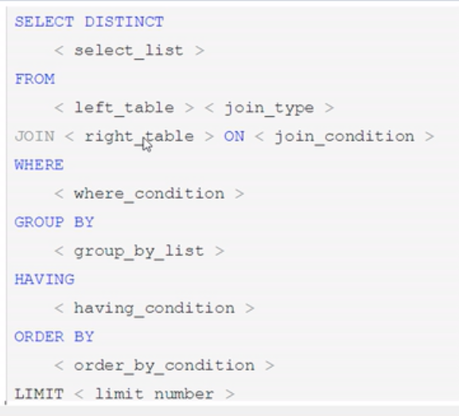
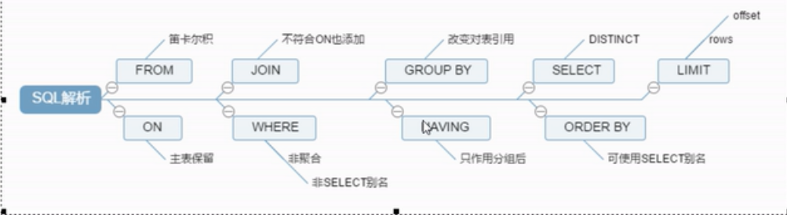
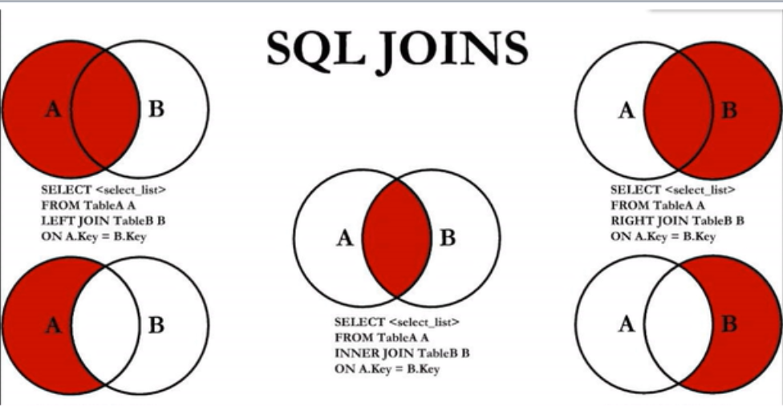
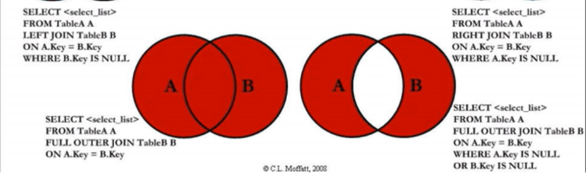

- ## 层
    - 连接、服务、引擎、存储
- ## 慢的原因
- ### 执行时间长 等待时间长
    - 查询语句
    - 索引失效
        - 创建索引
            - 单值索引 create index idx_user_name on user(name)
            - 多值索引 create index idx_user_nameEmail on user(name, email)
    - 关联查询太多join(设计缺陷或不得已的需求)
    - 服务器调优及各个参数设置
- ### 常见的Join查询
    - SQL执行顺序
        - 写的顺序
            - select from where/join on group by having order by limit
            - 
        - 机读
            - from on join where group by having select distinct order by limit
            - 
    - join图
        -   
        - 
    - 建表sql

- ### 索引简介
    - 是什么 
        - 帮助mysql高速获取数据的数据结构。本质：数据结构。 简单理解为排好序的快速查找数据结构。
        - 在数据之外，数据库系统还维护着满足特定查找算法的数据结构
        - 索引本身很大，不可能全部存在内存中，文件形式存在磁盘上
        - 没有特殊说明，都是指B树
        - 聚集索引，复合索引，前缀索引，唯一索引 B+树
    - 优势
        - 提高检索效率，降低数据库IO成本
        - 对数据排序，降低数据排序成本，降低CPU消耗
    - 劣势
        - 索引也是表，保存了主键和索引字段，占空间
        - 降低了更新表的速度
        - 只是提高效率的一个因素，要花时间建立最优秀的索引或优化调整
    - 索引分类
        - 单值索引
            - 一个索引只包含单个列，一个表可以有多个单列索引
        - 唯一索引
            - 索引列的值必须唯一，但允许有空值
        - 复合索引
            - 一个索引包含多个列
        - 语法
            - 创建
                - create [unique] index indexName on mytable(columnname(length))
                - alter mytable add [unique] index [undexName] on (columnname(length))
            - 删除
                - drop index [indexName] on mytable
            - 查看
                - show index from table_name\G
        - mysql索引结构
            - BTree索引
        - 需要建
            - 主键自动建立
            - 频繁作为查询条件的字段
            - 查询中与其他表关联的字段，外键关系建立索引         
            - 单键/组合 在高并发倾向创建组合索引
            - 查询中排序的字段，排序字段通过索引访问大大提高排序速度
            - 查询中统计或者分组字段
        - 不要建
            - where条件用不到的不创建
            - 表记录太少（百万以下）
            - 经常增删改
            - 某个数据列包含太多重复且平均分配内容
- ### 性能分析
    - Mysql Query Optimizer
    - 常见瓶颈
        - CPU 在饱和的时候一般发生在数据存入内存或从磁盘读取数据的时候
        - IO 磁盘I/O平静发生在装入数据远大于内存容器的时候
        - 服务器硬件 top,free,iostat和vmstat查看系统的性能状态
    - Explain
        - 是什么
            - 使用EXPLAIN关键字可以模拟优化器执行SQL查询语句，从而知道MySQL是如何处理 你的SQL语句的。分析你的查询语句或是表结构的性能瓶颈
        - 能干嘛
            - 表的读取顺序
            - 数据读取操作的操作类型
            - 那些索引可以使用
            - 那些索引被实际使用
            - 表之间的引用
            - 每张表有多少行被优化器查询 
        - 怎么玩
            - Explain  + Sql语句
            - 包含信息
        - 各字段解释
            - id 
                - id相同顺序加载，不同id越高越先执行
            - select_type
                - simple    简单的select不包含子查询或union
                - primary   包括子查询，最外层primary
                - subquery  子查询括号里面的
                - derived   在from列表中包含的子查询被标记为derived,mysql会递归执行这些子查询，把结果放在临时表
                - union     第二个select出现在union之后，被标记为union
                - union result  从union表获取结果的result
            - table 显示数据关于哪张表的
            - type
                - 最好到最差 System>const>ep_ref>ref>range>index>All
                - 至少达到range级别，最好达到ref
                - system：表只有一行数据，这是const类型的特例
                - const：通过索引一次就找到，const用于比较primary key或unique索引
                - eq_ref: 唯一索引扫描。对于每个索引键，表中只有一条记录与之匹配
                - ref: 非唯一性索引扫描，返回匹配某个单独值的所有行
                - range: 只检索给定范围的行，使用一个索引来选择行。key列显示使用了那个索引。一般就是在where语句出现between and,in,>,<
                - index full index scan，只遍历索引树
                - All  full table scan
            - possible_keys
                - 显示可能应用在这张表的索引，不一定实际查询中使用
            - key
                - 实际使用的索引，null则没有使用。若使用了覆盖索引，则仅出现key表中
            - key_len
                - 索引中使用的字节数，查询索引的长度，长度越短越好。显示最大可能长度，并非实际使用长度。
            - ref
                - 显示索引的哪一列被使用了，如果可能的话，是一个常数。哪些列或常量被用于查找索引列上的值
            - rows
                - 每张表有多少行被优化器查询过